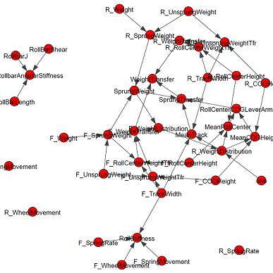
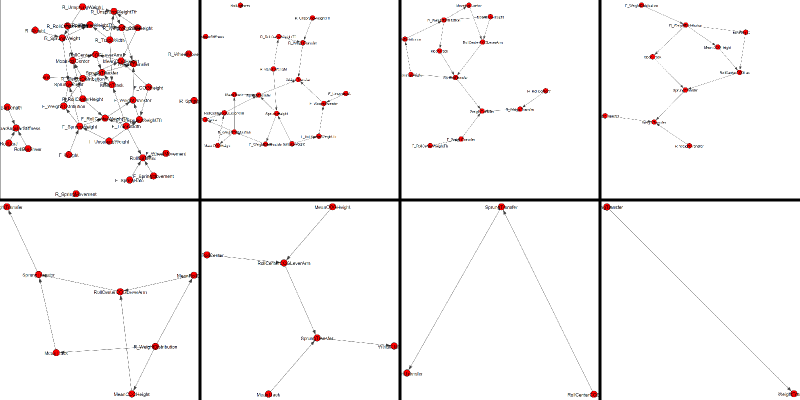

.. Graph Variable Solver documentation master file, created by
   sphinx-quickstart on Sun Feb 17 21:35:13 2013.
   You can adapt this file completely to your liking, but it should at least
   contain the root `toctree` directive.

Graph Variable Solver
=================================================

Introduction
++++++++++++++

Graph Variable Solver is a helper wrapper lying on top of Sympy that allows solving
complex variable networks in a sensible order.  Variables and relationships can be 
specified in a JSON based input file. 

Graph Variable Solver was originally developed to help solve variables for suspension 
design at Oxford Brookes University.  An example of a complex variable network is given
below:

   Suspension Variable Network (Half Car, Simplified)

Variables are indicated by red circles and the relationships between variables are 
indicated by arrows. The solver works by building a dependency network like shown above
and iteratively determining which variables have no unsolved dependencies.  

The solver can output PDF graphs showing which variables are solved at each stage, for 
instance by running::

    python solver.py data/suspension.json

the sequence below was generated.  This should be read from left to right, row by row and shows 
the gradual 'pruning' of the variable graph as individual variables are solved.  The PDF files 
that these images were built from was generated by the `GraphManager`.

   Solving the variable graph - gradual simplification of the network 

Contents
+++++++++

.. toctree::
   :maxdepth: 2
   
   graphmanager
   graphvariable
   inputformat
   console

Indices and tables
+++++++++++++++++++

* :ref:`genindex`
* :ref:`modindex`
* :ref:`search`

